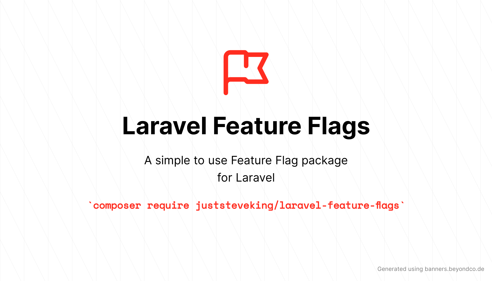

# Laravel Feature Flags

[![Software License][ico-license]](LICENSE.md)
[](https://php.net)
[](https://github.com/JustSteveKing/laravel-feature-flags/actions/workflows/tests.yml)
[![Latest Version on Packagist][ico-version]][link-packagist]
[![Total Downloads][ico-downloads]][link-downloads]

<p align="center">



</p>

A simple to use Feature Flag package for Laravel, allowing you to create Feature Groups and assign Users to them - while also being able to give users override access to given features outside of their groups.

## Installation

You can install the package via composer:

```bash
composer require juststeveking/laravel-feature-flags
```

You can publish the config file with:

```bash
php artisan vendor:publish --provider="JustSteveKing\Laravel\FeatureFlags\FeatureFlagsServiceProvider"
```

This is the contents of the published config file:

```php
return [
    'middleware' => [
        'mode' => 'abort',

        'redirect_route' => '/',

        'status_code' => 404,
    ],
];
```

You will then need to migrate the database changes:

```bash
php artisan migrate
```

## Usage

This package allows you to manage user features and feature groups in a database.


**All Feature and Feature Group names will be normalised to lower case on save.**


To use this package your User model needs to have the `HasFeatures` trait:

```php
<?php

namespace App\Models;

use Illuminate\Foundation\Auth\User as Authenticatable;
use JustSteveKing\Laravel\FeatureFlags\Concerns\HasFeatures;

class User extends Authenticatable
{
    use HasFeatures;
}
```

This will allow you to manage features and feature groups on your user model.

A *User* can belong to many *Feature Groups*, but can also be assigned access to specific *Features*.

### Working with Feature Groups

```php
// This will create the Feature Group if not already created and attach the user to it.
auth()->user()->addToGroup('beta testers');

// Alternatively you can use the following syntax
auth()->user()->joinGroup('beta testers');

// You can check if a user is a member of a feature group
auth()->user()->inGroup('beta testers');

// You can also get a user to leave a feature group
auth()->user()->leaveGroup('beta testers');

// You can also pass in more than one group name
auth()->user()->joinGroup('beta testers', 'api testers');
```

### Working with Features

```php
// This will create the Feature if not already created and attach the user to it.
auth()->user()->giveFeature('run reports');

// You can check if a user has a specific feature
auth()->user()->hasFeature('run reports');

// You can also remove a feature for a user
auth()->user()->removeFeature('run reports');

// Like with Feature Groups you can pass in more than one option
// These will return if any are matched.
auth()->user()->hasFeature('run reports', 'admin');
```

### Putting it together

To use the package as a whole:

```php
// Create a Feature Group
$group = FeatureGroup::create([
    'name' => 'Beta Testers'
]);

// Create a Feature
$feature = Feature::create([
    'name' => 'API Access'
]);

// Add the Feature to the Feature Group
$group->addFeature($feature);

// Assign a User to the Group
auth()->user()->joinGroup($group->name);

if (auth()->user()->groupHasFeature('api access')) {
    // The user belongs to a group that has access to this feature.
}

if (auth()->user()->hasFeature('run reports')) {
    // The user has been given access to this feature outside of group features
}

if (auth()->user()->hasFeature('user level feature')) {
    // The user has access to this feature as a user or through a group.
}
```

## Template Usage

There are some Blade Directives to help control access to features in your UI:

```php
// You can check if a user has a specific feature
@feature('api access')
    <x-api-console />
@endfeature

// You can check if a user is a member of a feature group
@featuregroup('beta testers')
    <x-group-feature />
@endfeaturegroup

// You can check if a user is a member of a group with access to a feature
@groupfeature('api access')
    <x-api-console />
@endgroupfeature
```

## Middleware

There are some middleware classes that you can use:

By default you can use:

- `\JustSteveKing\Laravel\FeatureFlags\Http\Middleware\FeatureMiddleware::class`
- `\JustSteveKing\Laravel\FeatureFlags\Http\Middleware\GroupMiddleware::class`

There 2 middleware classes will either abort on failure, or redirect. The way these work can be managed in the config file for the package. It allows you to set a mode for the middleware (either `abort` or `redirect`) and also allows you to set a `redirect_route` or `status_code`.

Then there is also:

- `\JustSteveKing\Laravel\FeatureFlags\Http\Middleware\API\FeatureMiddleware::class`
- `\JustSteveKing\Laravel\FeatureFlags\Http\Middleware\API\GroupMiddleware::class`

These 2 middleware classes only have the one mode of `abort` but will ready from your config file for the package to know what status code to return, these classes are made specifically for APIs.

### To limit access to users with specific features

Add the following to your `app/Http/Kernel.php`

```php
protected $routeMiddleware = [
    'feature' => \JustSteveKing\Laravel\FeatureFlags\Http\Middleware\FeatureMiddleware::class,
];
```

You can pass through more than one feature name, and pass them in a friendlier format or as they are:

```php
Route::middleware(['feature:run-reports,print reports'])->group(/* */);
```

### To limit access to users who are part of a feature group

Add the following to your `app/Http/Kernel.php`

```php
protected $routeMiddleware = [
    'feature-group' => \JustSteveKing\Laravel\FeatureFlags\Http\Middleware\GroupMiddleware::class,
];
```

You can pass through more than one feature group name, and pass them in a friendlier format or as they are:

```php
Route::middleware(['feature-group:beta-testers,internal,developer advocates'])->group(/* */);
```

## Artisan Commands

There are a number of artisan commands available for interacting with feature flags.
```bash
  feature-flags:activate-feature           Activates a feature
  feature-flags:activate-feature-group     Activates a feature group
  feature-flags:add-feature                Add a new feature
  feature-flags:add-feature-group          Add a new feature group
  feature-flags:add-feature-to-group       Add a feature to a group
  feature-flags:deactivate-feature         Deactivates a feature
  feature-flags:deactivate-feature-group   Deactivates a feature group
  feature-flags:view-feature-groups        View feature groups
  feature-flags:view-features              View features
  feature-flags:view-groups-with-features  View groups with features
```

## Testing

``` bash
$ composer run test
```

## Contributing

Please see [CONTRIBUTING](CONTRIBUTING.md) and [CODE_OF_CONDUCT](CODE_OF_CONDUCT.md) for details.

## Security

If you discover any security related issues, please email juststevemcd@gmail.com instead of using the issue tracker.

## Credits

- [Steve McDougall][link-author]
- [All Contributors][link-contributors]

## License

The MIT License (MIT). Please see [License File](LICENSE.md) for more information.

[ico-version]: https://img.shields.io/packagist/v/juststeveking/laravel-feature-flags.svg?style=flat-square
[ico-license]: https://img.shields.io/badge/license-MIT-brightgreen.svg?style=flat-square
[ico-downloads]: https://img.shields.io/packagist/dt/juststeveking/laravel-feature-flags.svg?style=flat-square

[link-packagist]: https://packagist.org/packages/juststeveking/laravel-feature-flags
[link-downloads]: https://packagist.org/packages/juststeveking/laravel-feature-flags

[link-author]: https://github.com/JustSteveKing
[link-contributors]: ../../contributors
